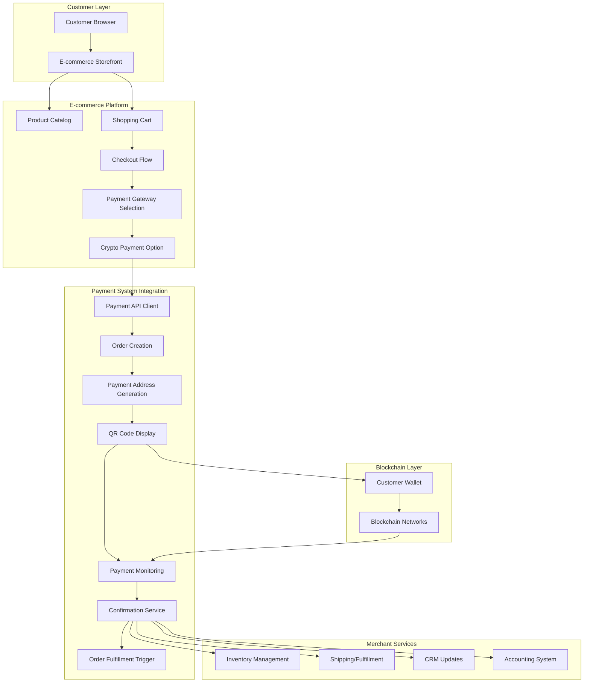
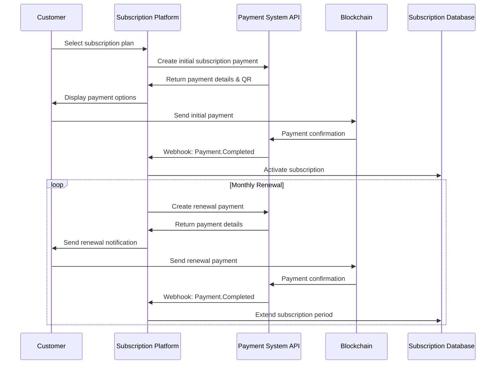
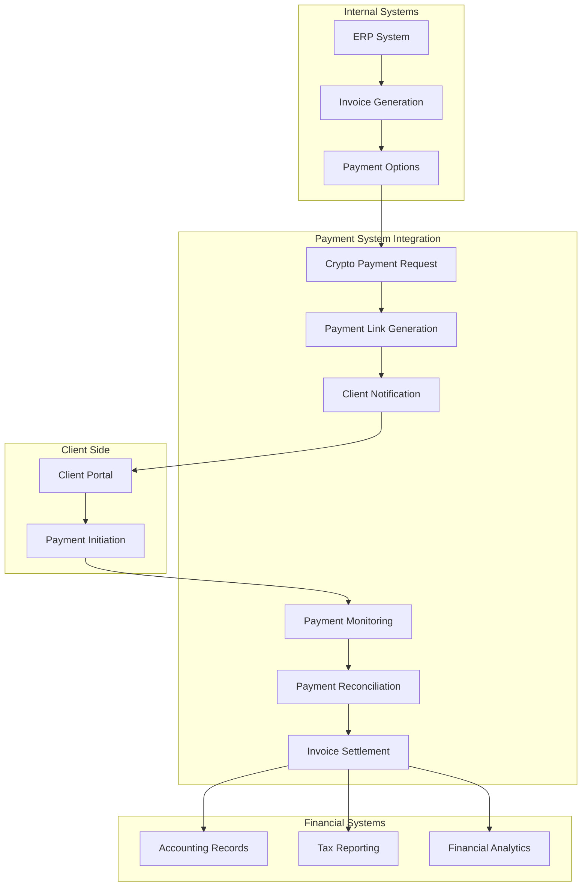
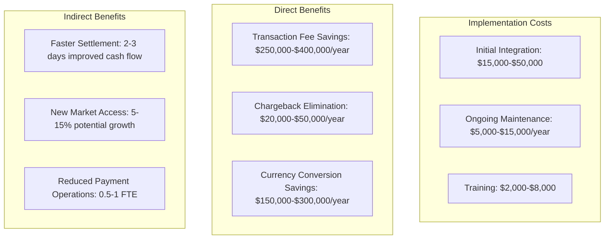

# Enterprise Implementation Guide & Business Use Cases

## Enterprise Integration Scenarios

This document outlines key enterprise integration patterns and implementation strategies for the Cryptocurrency Payment System. It provides technical guidance for specific business use cases across various industry verticals.

### E-commerce Integration Architecture

The following diagram illustrates a comprehensive implementation architecture for enterprise e-commerce platforms:



#### Implementation Components

1. **E-commerce Integration SDK**
   - Pre-built plugins for major platforms (Shopify, Magento, WooCommerce, etc.)
   - Client libraries for custom platforms
   - Checkout widget for frontend integration

2. **Backend Integration Services**
   - RESTful API for order creation and management
   - Webhook endpoints for real-time status updates
   - Background payment monitoring services

3. **Security and Compliance**
   - PCI DSS-compliant handling of customer data
   - Secure key management for API authentication
   - Audit logging for transaction history

#### Implementation Steps for Enterprise E-commerce

1. **Pre-Integration Planning**
   - Identify integration touchpoints in checkout flow
   - Determine backend webhook receivers
   - Plan database schema for order/payment mapping

2. **Technical Implementation**
   - Install SDK/plugin appropriate for platform
   - Configure API authentication credentials
   - Set up webhook endpoints and handlers
   - Implement payment status tracking logic
   - Configure inventory and fulfillment triggers

3. **Testing and Validation**
   - Validate payment flow in sandbox environment
   - Test webhook handlers with simulated events
   - Perform end-to-end transaction testing
   - Validate error handling and recovery

4. **Production Deployment**
   - Deploy integration to production environment
   - Monitor initial transactions
   - Set up alerts for payment processing issues

5. **Optimization and Scaling**
   - Analyze payment conversion metrics
   - Optimize checkout UX based on data
   - Implement caching for performance improvement
   - Scale webhook processing as volume increases

### Digital Services Subscription Platform

For SaaS and digital services businesses, the following integration model supports subscription-based crypto payments:



#### Technical Implementation Considerations

1. **Subscription Management Logic**
   - Customer subscription records with payment history
   - Renewal tracking and notification system
   - Grace period handling for delayed payments
   - Subscription tier management and upgrades

2. **Payment System Integration**
   - API integration for creating payment requests
   - Webhook handlers for payment status updates
   - Customer payment preference storage
   - Dynamic QR code generation for renewals

3. **Example API Implementation (Node.js)**

```javascript
// Example subscription payment creation
const createSubscriptionPayment = async (customerId, planId, recurring = true) => {
  const plan = await db.getSubscriptionPlan(planId);
  const customer = await db.getCustomer(customerId);
  
  // Create payment request
  const paymentRequest = {
    amount: plan.price,
    currency: customer.preferredCurrency || 'ETH',
    network: customer.preferredNetwork || 'MAINNET',
    description: `${plan.name} Subscription - ${customer.email}`,
    metadata: {
      customer_id: customerId,
      plan_id: planId,
      subscription_type: recurring ? 'recurring' : 'one-time',
      renewal_date: recurring ? 
        new Date(Date.now() + 30 * 24 * 60 * 60 * 1000).toISOString() : null
    },
    webhook_url: 'https://api.yourservice.com/webhooks/crypto-payments'
  };
  
  // Call Payment System API
  const response = await axios.post(
    'https://api.paymentsystem.com/v1/payments/create-order',
    paymentRequest,
    {
      headers: {
        'X-API-Key': process.env.PAYMENT_SYSTEM_API_KEY,
        'Content-Type': 'application/json'
      }
    }
  );
  
  // Store payment details in database
  await db.createSubscriptionPayment({
    customerId,
    planId,
    paymentId: response.data.payment_id,
    status: 'PENDING',
    amount: plan.price,
    currency: customer.preferredCurrency || 'ETH',
    dueDate: new Date(),
    paymentAddress: response.data.payment_details.address
  });
  
  return response.data;
};
```

4. **Webhook Handler Implementation**

```javascript
// Example webhook handler for subscription payments
app.post('/webhooks/crypto-payments', async (req, res) => {
  // Verify webhook signature
  const signature = req.headers['x-payment-signature'];
  const isValid = verifySignature(req.body, signature, process.env.WEBHOOK_SECRET);
  
  if (!isValid) {
    return res.status(401).send('Invalid signature');
  }
  
  const event = req.body;
  const { payment_id, status, metadata } = event.data;
  
  // Acknowledge webhook receipt immediately
  res.status(200).send('Webhook received');
  
  // Process based on event type
  if (event.event_type === 'payment.completed') {
    // Handle successful payment
    if (metadata && metadata.subscription_type === 'recurring') {
      // Update subscription record
      await db.updateSubscription({
        customerId: metadata.customer_id,
        planId: metadata.plan_id,
        status: 'ACTIVE',
        paidUntil: metadata.renewal_date,
        lastPaymentId: payment_id
      });
      
      // Trigger access provisioning
      await provisionAccess(metadata.customer_id, metadata.plan_id);
      
      // Send confirmation to customer
      await sendSubscriptionConfirmation(metadata.customer_id, metadata.plan_id);
    }
  } else if (event.event_type === 'payment.failed') {
    // Handle failed payment
    await db.updateSubscriptionPayment(payment_id, 'FAILED');
    await sendPaymentFailureNotification(metadata.customer_id);
  }
});
```

### Enterprise B2B Invoice Payments

For B2B enterprises accepting cryptocurrency for invoice payments, the integration follows this pattern:



#### Implementation Requirements for Enterprise B2B

1. **ERP/Accounting System Integration**
   - API connectors for major ERP systems (SAP, Oracle, NetSuite)
   - Invoice data synchronization
   - Payment reconciliation automation
   - Tax and regulatory compliance handling

2. **Client-Facing Components**
   - Branded payment portal for clients
   - Multi-currency selection options
   - Payment receipt generation
   - Payment status tracking interface

3. **Security Considerations**
   - Role-based access controls for payment management
   - Segregation of duties for financial operations
   - Audit trail for compliance requirements
   - Data retention policies for financial records

4. **Example: SAP Integration Implementation**

```java
// SAP ABAP Code Example for Invoice Payment Integration
METHOD create_crypto_payment_for_invoice.
  DATA: lv_invoice_data TYPE ty_invoice_data,
        lv_payment_request TYPE ty_payment_request,
        lv_response TYPE ty_api_response.
        
  " Get invoice details from SAP
  SELECT SINGLE * FROM bkpf INTO @DATA(ls_invoice_header)
    WHERE belnr = @iv_invoice_number
    AND bukrs = @iv_company_code
    AND gjahr = @iv_fiscal_year.
    
  " Prepare payment request
  lv_payment_request-amount = ls_invoice_header-dmbtr.
  lv_payment_request-currency = 'ETH'.  " Default or configurable
  lv_payment_request-network = 'MAINNET'.
  lv_payment_request-description = |Invoice { iv_invoice_number } payment|.
  lv_payment_request-metadata-invoice_number = iv_invoice_number.
  lv_payment_request-metadata-company_code = iv_company_code.
  lv_payment_request-webhook_url = 'https://erp-api.company.com/api/payment-webhooks'.
  
  " Call external API
  CALL METHOD lo_http_client->request->set_header_field
    EXPORTING
      name  = 'X-API-Key'
      value = lv_api_key.
      
  CALL METHOD lo_http_client->request->set_header_field
    EXPORTING
      name  = 'Content-Type'
      value = 'application/json'.
      
  " Set request body with payment details
  lv_request_body = /ui2/cl_json=>serialize( lv_payment_request ).
  lo_http_client->request->set_cdata( lv_request_body ).
  
  " Send request
  lo_http_client->send( ).
  lo_http_client->receive( ).
  lv_response = lo_http_client->response->get_cdata( ).
  
  " Parse response
  /ui2/cl_json=>deserialize( 
    EXPORTING json = lv_response
    CHANGING data = ls_payment_response ).
    
  " Update SAP records with payment link
  UPDATE bkpf SET zuonr = ls_payment_response-payment_id
    WHERE belnr = iv_invoice_number
    AND bukrs = iv_company_code
    AND gjahr = iv_fiscal_year.
    
  " Create payment tracking record
  INSERT INTO zcrypto_payments VALUES @( VALUE #(
    payment_id = ls_payment_response-payment_id,
    invoice_number = iv_invoice_number,
    company_code = iv_company_code,
    fiscal_year = iv_fiscal_year,
    amount = ls_invoice_header-dmbtr,
    currency = 'ETH',
    status = 'PENDING',
    created_on = sy-datum,
    created_at = sy-uzeit,
    payment_address = ls_payment_response-payment_details-address
  ) ).
  
  " Return payment details for client communication
  rv_payment_data = ls_payment_response.
ENDMETHOD.
```

## ROI Analysis for Enterprise Implementation

| Integration Type | Development Effort | Time to Market | Cost Savings | Revenue Impact |
|------------------|-------------------|----------------|--------------|----------------|
| E-commerce Plugin | Low (1-2 weeks) | Fast | 2.5% per transaction | +5-15% new customers |
| SaaS Subscription | Medium (3-4 weeks) | Medium | 2-3% recurring revenue | +10-20% retention |
| B2B Invoicing | High (6-8 weeks) | Longer | 3-4% on international | +15-25% payment speed |
| Marketplace | Medium (4-6 weeks) | Medium | 1.5-2.5% platform fees | +5-10% seller adoption |

### Cost-Benefit Analysis

For an enterprise with $10M annual payment volume:



## Enterprise Migration Strategy

For enterprises transitioning from traditional payment methods to cryptocurrency:

1. **Phase 1: Parallel Implementation (Weeks 1-4)**
   - Implement crypto payments alongside existing methods
   - Begin with a limited product line or customer segment
   - Collect baseline metrics for comparison

2. **Phase 2: Integration Expansion (Weeks 5-8)**
   - Extend cryptocurrency option to all products/services
   - Integrate with additional backend systems
   - Implement comprehensive monitoring and alerting

3. **Phase 3: Optimization (Weeks 9-12)**
   - Analyze payment conversion and customer adoption data
   - Optimize checkout flow based on analytics
   - Implement advanced features (auto-conversion, etc.)

4. **Phase 4: Full Deployment (Weeks 13+)**
   - Scale to full production volume
   - Implement promotional incentives for crypto adoption
   - Train customer service team on cryptocurrency support

## Technical Support Matrix

| Integration Challenge | Solution Approach | Support Resources |
|-----------------------|-------------------|-------------------|
| High transaction volume | Implement connection pooling, use webhook batching | Enterprise Performance Guide, Support ticket priority |
| Legacy system integration | Use middleware connectors, implement ETL processes | Integration Specialists, Custom connector development |
| Complex reconciliation | Automated matching algorithms, dedicated reconciliation APIs | Finance Integration Guide, Reconciliation webinars |
| Multi-entity deployment | Hierarchical account structure, role-based permissions | Enterprise Management Console, Multi-entity setup guide |

## Contact Information

For enterprise implementation support:

- **Implementation Team**: implementation@paymentsystem.example.com
- **Enterprise Support**: enterprise-support@paymentsystem.example.com
- **Technical Documentation**: https://docs.paymentsystem.example.com/enterprise
- **Integration Specialists**: Schedule a consultation at https://paymentsystem.example.com/enterprise/consultation 