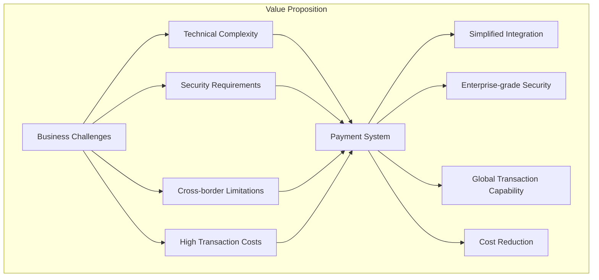
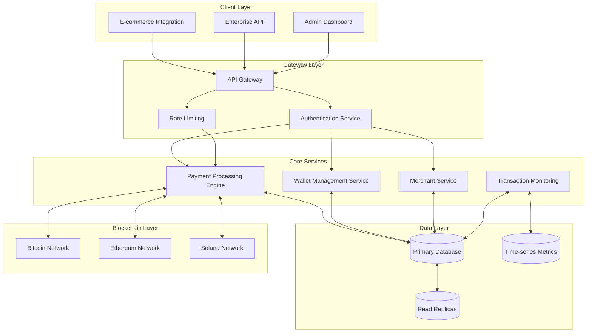
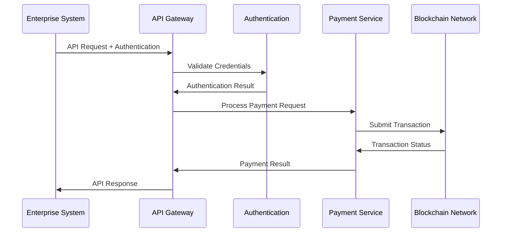
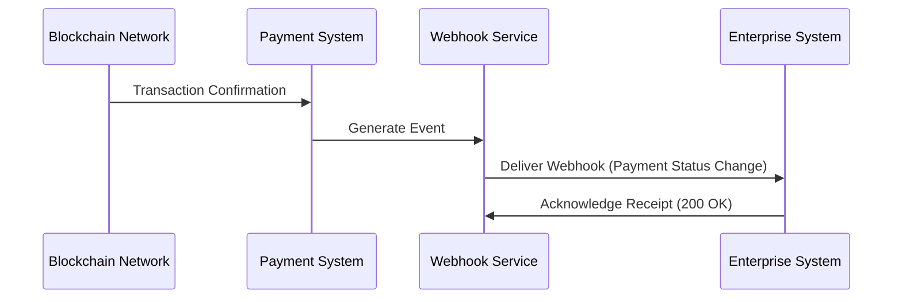
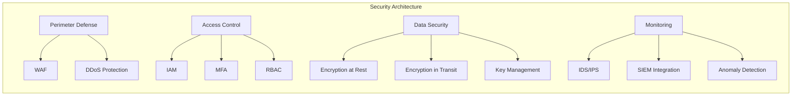
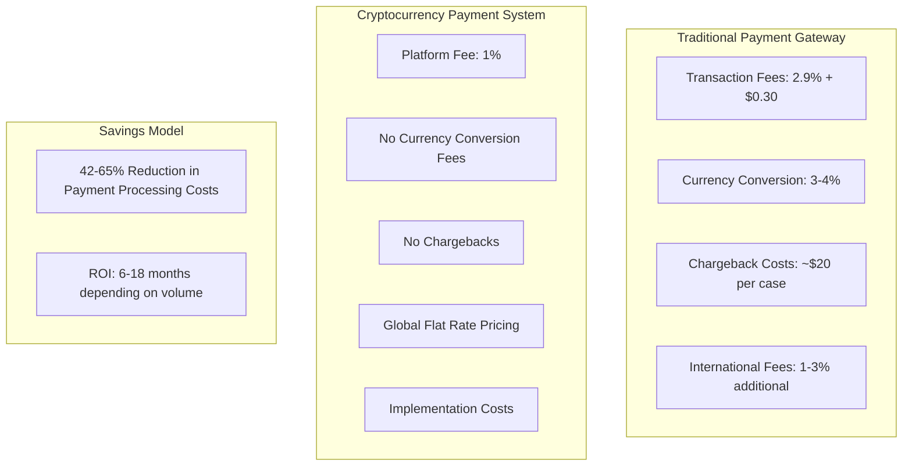
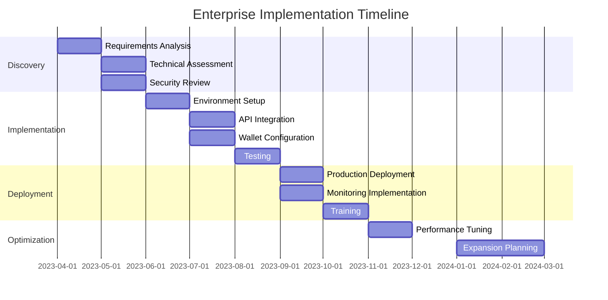

# Cryptocurrency Payment System: Enterprise Solution Overview

## Executive Summary

The Cryptocurrency Payment System is an enterprise-grade payment infrastructure designed for businesses seeking to expand their payment capabilities by seamlessly integrating cryptocurrency transactions. This secure, scalable platform bridges traditional commerce with blockchain technology, providing businesses with the tools to tap into the growing $1.5+ trillion cryptocurrency market without specialized technical knowledge.

## Enterprise Market Opportunity

The global cryptocurrency payment gateway market is projected to reach $8.15 billion by 2030, growing at a CAGR of 16.8%. This growth is driven by:

1. **Cross-border E-commerce Expansion**: 70% of online shoppers now make purchases from international retailers
2. **Digital Transformation Acceleration**: 89% of companies have adopted or plan to adopt digital-first business strategies
3. **Cryptocurrency Adoption**: Over 300 million global crypto users with 63% of transactions now for commerce rather than speculation
4. **Enterprise Demand**: 82% of Fortune 500 companies are exploring blockchain integration

Our solution targets enterprises across multiple sectors:

| Industry | Market Size | Key Value Drivers |
|----------|-------------|-------------------|
| E-commerce | $5.7 Trillion | Reduced fees, fraud prevention, global reach |
| Digital Services | $4.2 Trillion | Subscription management, microtransactions |
| Financial Services | $8.3 Trillion | Innovation, cost reduction, settlement speed |
| Enterprise Software | $601 Billion | Integration capabilities, compliance, security |

## Technical Architecture Overview

The Cryptocurrency Payment System employs a modern, microservices-based architecture designed for enterprise deployment requirements including high availability, scalability, and security.

### System Components

1. **API Gateway**: Unified entry point with load balancing, request routing, and rate limiting
2. **Authentication Service**: JWT and API key authentication with role-based access control
3. **Payment Processing Engine**: Core transaction handling logic with multi-currency support
4. **Wallet Management Service**: Secure HD wallet implementation with private key encryption
5. **Transaction Monitoring**: Real-time blockchain transaction tracking and confirmation service
6. **Data Layer**: PostgreSQL for transactional data with read replicas for scaling
7. **Blockchain Connectors**: Interfaces to multiple blockchain networks

## Enterprise Integration Capabilities

The platform provides multiple integration options designed for different enterprise requirements:

### 1. RESTful API Integration

### 2. Webhook-Based Event System

### 3. Embeddable Components

* **Checkout Widget**: Customizable payment UI components for web integration
* **Mobile SDKs**: Native SDKs for iOS and Android applications
* **iFrame Solutions**: PCI-compliant embedded payment forms

## Security and Compliance

The platform implements enterprise-grade security measures:

| Security Domain | Implementation |
|-----------------|----------------|
| Data Encryption | AES-256 for sensitive data encryption at rest |
| Communications | TLS 1.3 for all API communications |
| Authentication | Multi-factor authentication, JWT with short expiration, API key rotation |
| Key Management | HSM-backed key storage, BIP-39 wallet security |
| Audit Logging | Immutable audit trails for all system operations |
| Compliance | SOC 2 Type II compliance roadmap, PCI-DSS for applicable components |

## Deployment Models

The system supports flexible deployment options for enterprise requirements:

1. **SaaS Offering**: Fully-managed cloud deployment
2. **Private Cloud**: Dedicated deployment in customer cloud environment (AWS, Azure, GCP)
3. **Hybrid Model**: Core services in SaaS with sensitive components on-premises
4. **On-Premises**: Full deployment in enterprise data center (for high-security requirements)

## Performance and Scalability

The platform is designed for enterprise-scale transaction volumes:

* **Transaction Throughput**: Up to 1,000 transactions per second
* **Response Time**: < 200ms API response time (99th percentile)
* **Availability**: 99.99% uptime SLA
* **Horizontal Scaling**: Automatic scaling based on load metrics
* **Global Deployment**: Edge caching and regional deployments for global enterprises

## Total Cost of Ownership Analysis

For a typical enterprise processing $10M annually:
* **Traditional Gateway Costs**: $290,000 - $650,000
* **Cryptocurrency Payment System**: $100,000 - $170,000
* **Annual Savings**: $120,000 - $480,000

## Implementation Roadmap

## Strategic Business Advantages

1. **Revenue Expansion**: Tap into the rapidly growing cryptocurrency economy ($1.5+ trillion)
2. **Operational Efficiency**: Reduce payment processing costs by up to 65%
3. **Global Market Access**: Eliminate cross-border payment friction
4. **Risk Mitigation**: Eliminate chargeback fraud and reduce compliance costs
5. **Competitive Differentiation**: Position as innovative financial technology leader
6. **Future-Proofing**: Prepare for the evolution of digital payments and CBDCs

## Enterprise Support and SLAs

The platform includes comprehensive enterprise support:

* **Dedicated Technical Account Management**: Assigned TAM for enterprise clients
* **24/7 Critical Support**: Around-the-clock monitoring and support for production systems
* **Implementation Assistance**: Professional services for custom integration requirements
* **Training**: Technical and operational training for enterprise teams
* **SLA Guarantees**: Defined service level agreements for uptime, response time and issue resolution

## Contact Information

For enterprise inquiries and implementation discussions:

* **Enterprise Sales**: enterprise@paymentsystem.example.com
* **Technical Partnerships**: partnerships@paymentsystem.example.com
* **Enterprise Support**: enterprise-support@paymentsystem.example.com
* **Security Team**: security@paymentsystem.example.com